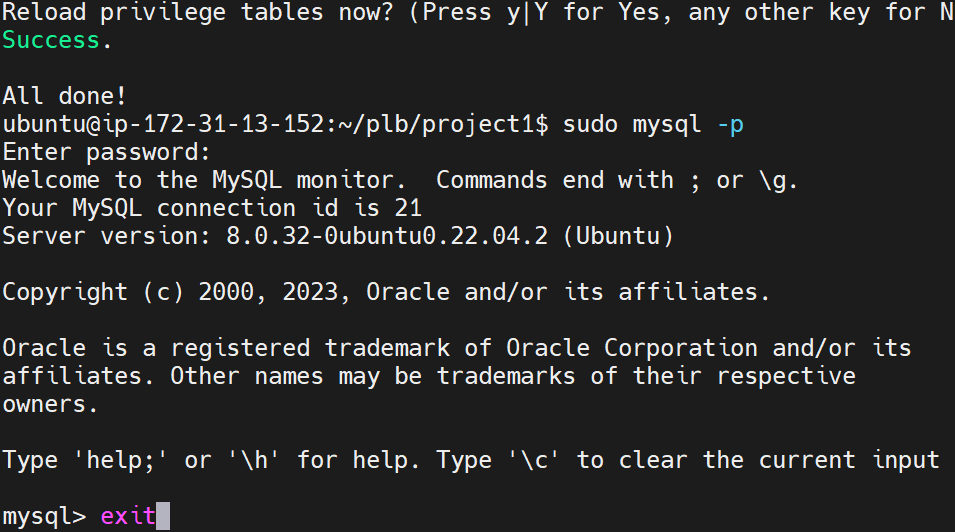

## STEP 2 — INSTALLING MYSQL

$ sudo apt install mysql-server

$ sudo mysql

The output is 

Define this user’s password as PassWord.1.

ALTER USER 'root'@'localhost' IDENTIFIED WITH mysql_native_password BY 'PassWord.1'

mysql> exit

interactive script by running:

    $ sudo mysql_secure_installation

Next I accepted Yes for VALIDATE PASSWORD PLUGIN.

And set MYSQL Root user password to 2

Screenshot of successful password change
 

Login to mysql  console 

        $ sudo mysql -p

Exit mysql console

        mysql> exit
