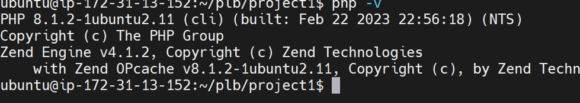

## STEP 3 — INSTALLING PHP

To install these 3 php, libapache2-mod-php and php-mysql at once, run:

$ sudo apt install php libapache2-mod-php php-mysql

Confirm installation with this command

php -v

Output is 

That is the end os successful installation of LAMP technology stack