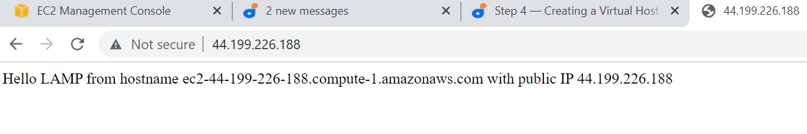

## STEP 4 — CREATING A VIRTUAL HOST FOR YOUR WEBSITE USING APACHE

Create the directory for projectlamp using ‘mkdir’ command as follows:

$ sudo mkdir /var/www/projectlamp

Change ownership of the directory to the current user, ubuntu:

 $ sudo chown -R  ubuntu:ubuntu /var/www/projectlamp

 Create a configuration file

 $ sudo vi /etc/apache2/sites-available/projectlamp.conf

 Paste the following and save,

 <VirtualHost *:80>
    ServerName projectlamp
    ServerAlias www.projectlamp 
    ServerAdmin webmaster@localhost
    DocumentRoot /var/www/projectlamp
    ErrorLog ${APACHE_LOG_DIR}/error.log
    CustomLog ${APACHE_LOG_DIR}/access.log combined
</VirtualHost>

sudo ls /etc/apache2/sites-available
output 

To enable the new virtual host:

    $ sudo a2ensite projectlamp

To disable Apache’s default website use a2dissite command 

    $ sudo a2dissite 000-default

    To make sure your configuration file doesn’t contain syntax errors, run:

       $ sudo apache2ctl configtest

Finally, reload Apache so these changes take effect:

      $ sudo systemctl reload apache2

     Create an index.html file in /var/www/projectlamp  so that we can test that the virtual host works as expected: 

sudo echo 'Hello LAMP from hostname' $(curl -s http://44.199.226.188/latest/meta-data/public-hostname) 'with public IP' $(curl -s http://44.199.226.188/latest/meta-data/public-ipv4) > /var/www/projectlamp/index.html

Openning my website URL using IP address:

http://<44.199.226.188>:80

My website screenshot 