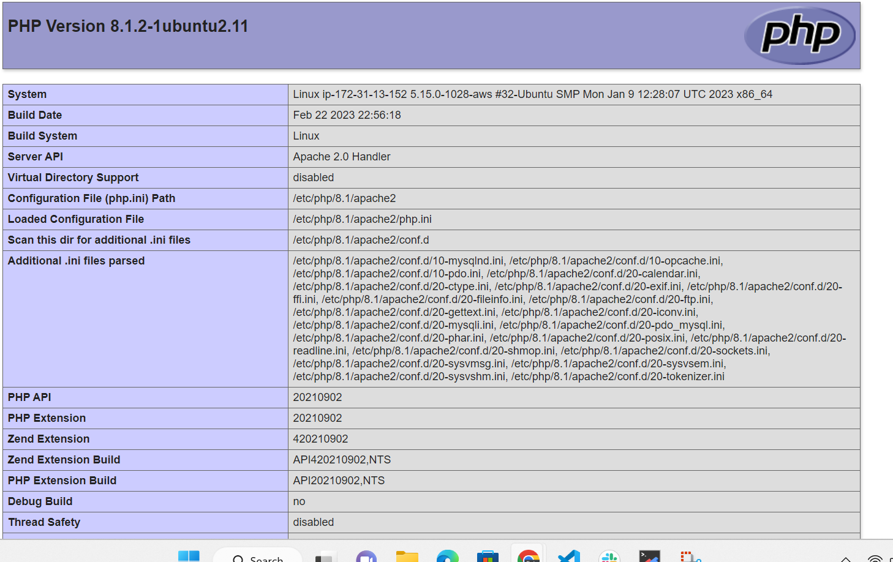

## STEP 5 — ENABLE PHP ON THE WEBSITE

edit the /etc/apache2/mods-enabled/dir.conf file and change the order in which the index.php file is listed within the DirectoryIndex directive so index.php file takes precedence over index.html

sudo vim /etc/apache2/mods-enabled/dir.conf

<IfModule mod_dir.c>
        #Change this:
        #DirectoryIndex index.html index.cgi index.pl index.php index.xhtml index.htm
        #To this:
        DirectoryIndex index.php index.html index.cgi index.pl index.xhtml index.htm
</IfModule>

Reload apache2 with

sudo systemctl reload apache2

Creat a php test script to confirm that Apache is able to handle and process requests for PHP files
  vim /var/www/projectlamp/index.php

  Paste the following, save and refresh the page

  The page 

  Run this to remove the page as it contains aensitive information

    $ sudo rm /var/www/projectlamp/index.php
